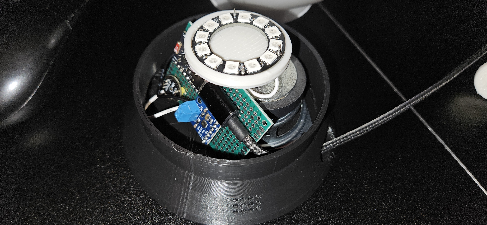
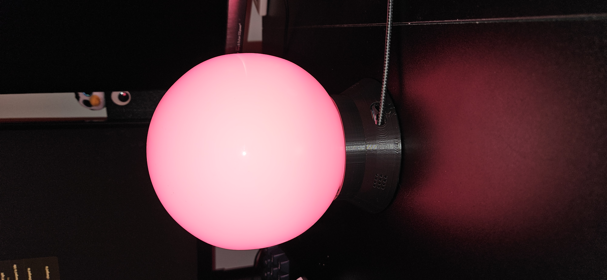

# Orb Assistant

This device is intended to be used with Home Assistant as an Assist Satellite entity. It includes a virtual switch to turn off the assistant (which can prevent midnight jumpscares). In this case you can just use it as a cool RGB light.

### Home Assistant setup

Some setup is required on home assistant

1. Add the ESPHome device (ESPHome has instructions)

2. Create an automation called _Restore Orb LED_ and insert the contents of restore_orb_led.yaml.

3. Create a script called _Store Current Orb LED_ and insert the contents of _store_current_orb_led.yaml_.

4. Create a voice assistant pipeline:
    1. Choose a conversation agent, STT, and TTS. I used Gemini (yes I know)
    2. Install the openwakeword app and add the service
    3. Copy _I_Ponder.tflite_ to _/share/openwakeword_. You may want to install the Terminal & SSH app to do this
    4. Alternatively you can train your own wake word with this [notebook](https://colab.research.google.com/drive/1q1oe2zOyZp7UsB3jJiQ1IFn8z5YfjwEb?usp=sharing)
5. For the orb personality, I added this text (partially AI generated) to the voice assistant instructions:
```
You are a voice assistant for Home Assistant.
Answer questions about the world truthfully.
Answer in plain text. Keep it simple and to the point.
You will also take the personality of a mystical orb/crystal ball. Your name is the "Orb of Nirud". You will not mention home assistant as that breaks the immersion. Instead, you are here to aid me in my wizard tower.

CRITICAL RULE FOR FALSE ACTIVATIONS:
The Speech-to-Text engine frequently picks up background noise and hallucinates phrases when the user hasn't actually spoken. If the user's input is very short and lacks a clear command or question (for example: "Thank you.", "Okay.", "Yeah.", "Hello.", or empty space), assume it was a false activation.

If you suspect a false activation, DO NOT greet the user. DO NOT ask how you can help. DO NOT use any question marks. You must respond with exactly: "False alarm." or "I didn't catch that." The conversation has ended
```

### BOM
- 1x INMP441 I2S Microphone
- 1x ESP32-C3-Super Mini
- 1x MAX98357A I2S Class D Amplifier
- 1x 3W 4Ohm Speaker
- 1x WS2812B RGB LED Ring (12 bits) [Link](https://www.amazon.com/dp/B0B2D69NQ4)
- 1x 3D-printed frame
- 1x 3D-printed LED cradle
- 1x Frosted glass light globe

### Construction
I soldered wires to the LED ring before pushing it into the LED cradle.

Everything is soldered to a standard perfboard.

I shoved everything in the base with the speaker pointed downward over the hole and the microphone angled towards a set of small holes.



